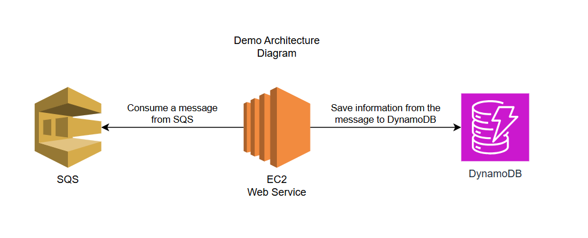

# MySqsListener

## Description

This project demonstrates the capabilities of using LocalStack to emulate AWS services such as SQS and DynamoDB.  
The project includes both .NET code and AWS CDK (Cloud Development Kit) code to create and interact with these services locally.

## Usage

This project demonstrates how to:

- Create and configure SQS queues and DynamoDB tables using AWS CDK.
- Interact with these resources using a .NET application.
- Use LocalStack to emulate AWS services locally for development and testing.



## Prerequisites
 
- [Docker](https://www.docker.com/) - for running LocalStack.
- [Node.js/NPM](https://nodejs.org/en) - for installing the AWS CDK.
- [Python](https://www.python.org/downloads/) - for running the AWS CDK.
- [.NET SDK](https://dotnet.microsoft.com/download) - for running the service.
- [AWS CLI](https://docs.aws.amazon.com/cli/latest/userguide/getting-started-install.html) - for interacting with AWS services.
- [AWS CDK](https://docs.aws.amazon.com/cdk/v2/guide/getting_started.html) - for creating and deploying AWS resources.
- [awslocal](https://github.com/localstack/awscli-local) - for interacting with LocalStack services.
- [cdklocal](https://github.com/localstack/aws-cdk-local) - for deploying CDK stacks to LocalStack.

## Project Structure

- [cdk](cdk): Contains the AWS CDK code for creating SQS and DynamoDB resources.
- [MySqsListener](MySqsListener): Contains the .NET code for interacting with the AWS resources.
- [Localstack](Localstack): Contains the docker-compose file for running LocalStack.

## Steps:

1. Clone the repository:  
   ```powershell
   git clone https://github.com/omri-ratson/localstack-dotnet-demo.git
   cd localstack-dotnet-demo
   ```
   
2. Setup CDK:
   1. Navigate to the `cdk` directory:
      ```powershell
      cd cdk
      ```
   2. Create a virtual environment and activate it:
       ```powershell
       python -m venv .venv
       .venv\Scripts\activate   # On Linux use `source .venv/bin/activate`
       ```

   3. Install the required dependencies:
      ```powershell
      pip install -r requirements.txt
      ```

   4. Synthesize the CDK stack (this takes the cdk code and generates the CloudFormation template to the terminal):
      ```powershell
      cdk synth
      cd ..
      ```

## Running the Project

1. **Start Localstack:**

   This project uses a special flavor of local stack called [localstack-persist](https://github.com/GREsau/localstack-persist) sense the free tier of localstack do not save state
   between restarts of the container.
   
   1. Start LocalStack using Docker:
      ```powershell
      cd Localstack
      docker compose up -d
      cd ..
      ```

   2. **Deploy CDK Stack:**  
      In the ~/.aws/config file add the following profile
      ```ini
      [profile local]
      region = us-west-2
      output = json
      endpoint_url = http://127.0.0.1:4566
      aws_access_key_id = test
      aws_secret_access_key = test
      ```
      1. Deploy the CDK stack to LocalStack:
         ```powershell
         cd cdk
         cdklocal bootstrap --profile local
         ```

      2. Deploy the CDK stack to LocalStack:
         ```powershell
         cdklocal deploy --profile local
         cd ..
         ```

2. **Run .NET Application**
    ```powershell
    cd MySqsListener
    dotnet run
    ```

3. **Using the Localstack GUI:**  
Go to https://app.localstack.cloud/ and login with your GitHub account.

4. **Using the CLI for interaction with Localstack:**  

   In case you want to use the AWS CLI commands with LocalStack, you can use the `awslocal` command instead of `aws`.
   This works on Linux machines, but on Windows there is an issue so you can use the `awsl` alias as follows:  
   Add the following code to your Powershell profile at `~\Documents\PowerShell\Microsoft.PowerShell_profile.ps1` - You can open it by running `notepad $PROFILE` in Powershell.

   ```powershell
   function awsl
   {
       param(
           [Parameter(ValueFromRemainingArguments = $true)]
           [string[]]$Args
       )
       aws @Args --profile local --endpoint-url http://127.0.0.1:4566
   }
   ```

   The reason for adding this alias is that the `awslocal` has some issues running in
   Windows, [I open a bug for the awslocal project here](https://github.com/localstack/awscli-local/issues/89).  
   
   Yes, I know you can do it with `awsl configure` command, but it won't add the `endpoint_url` to the profile.
   
   ```powershell
    # list tables:
    awsl dynamodb list-tables
    # list queues:
    awsl sqs list-queues
    # send a message to the queue:
    awsl sqs send-message --queue-url http://localhost:4566/000000000000/MyQueue --message-body "hello world"
    # get table items:
    awsl dynamodb scan --table-name MyTable
   ```
   